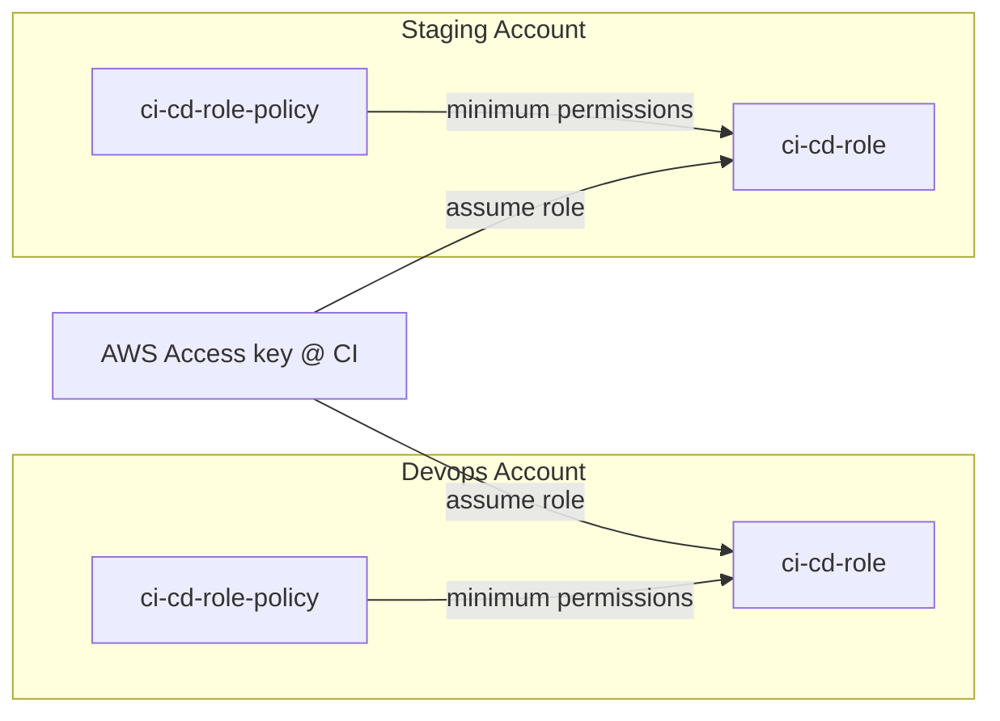
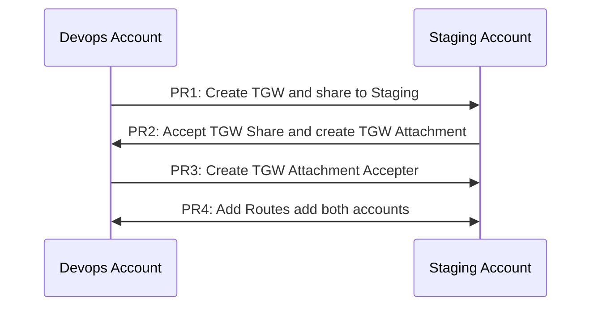
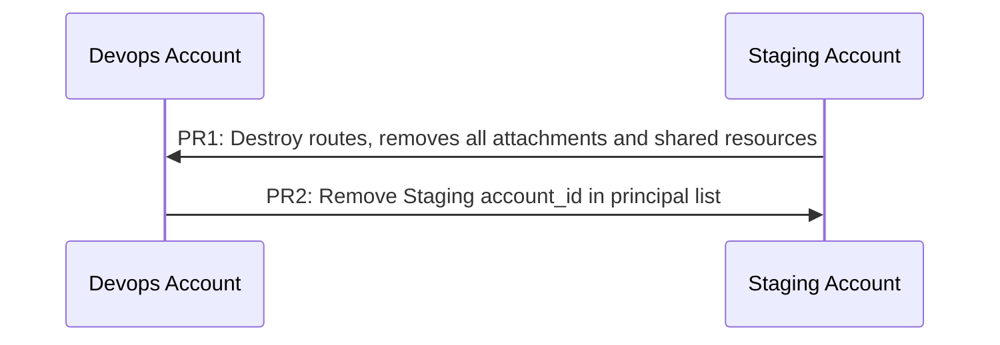

# otf-iac-aws-networking
Open Tofu Self-Service IaC for Networking

## Overview
This is a self-service Infrastructure as Code (IaC) solution for managing networking resources on AWS. Designed as an opinionated framework, it enhances DevOps and automation by abstracting the complexities of AWS networking, eliminating the need for in-depth expertise to build and connect your networks. At the same time, it offers the flexibility to accommodate advanced and complex networking configurations.

This framework enables the creation and management of a wide range of AWS networking resources, including:

- **VPCs**
- **Subnets**
- **Route Tables** and **Routes**
- **Network ACLs**
- **NAT Gateways**
- **Internet Gateways**
- **VPC Peering**
- **Route53 Resolvers**
- **VPC Endpoints**
- **Security Groups**
- **Transit Gateways**
- **Transit Gateway Sharing** (via AWS RAM)
- **Transit Gateway Route Tables**
- **Transit Gateway Attachments** *(Only VPC and TGW Peers)*
- **Prefix Lists**
- **Flow Logs** *(TODO)*
- **Direct Connect** *(TODO)*
- **VPN** *(TODO)*
- **DNS Firewall** *(TODO)*
- **Network Firewall** *(TODO)*
- **AWS Verified Access** *(TODO)*
- **Traffic Mirroring** *(TODO)*
- **Egress Only Internet Gateways** *(TODO)*

This comprehensive functionality ensures robust support for both simple and advanced networking setups on AWS.

## Prerequisites

- (Optional) [devkit](https://github.com/42dev-co/devkit) already provides:
    - `go-task` for task automation
- (Required) Docker Desktop or equivalent (all tools except go-tasks are run as container)
- (Optional) [go-tasks](https://taskfile.dev/) if you choose not to install `devkit`.

## Batteries included
- Open Policy Agent for policy as code and cost/budget control.
- Infacost for cost estimation 
- Scaffolded VPC comes with S3 bucket and DynamoDB Gateway Endpoint as they are free. :) 


# Getting Started

1. Clone this repository
2. Go to `base/provider.tf.tmpl` set bucket name  to your intended bucket name. You may choose to use other backend instead of S3.
3. Create an account and region if not already created in the workspaces folder by running:
   ```bash
   task scaffold account=<account> region=<region> account_id=<aws_account_id>
   ```
4. Add a VPC if not already created in the account + region by running:
   ```bash
   task scaffold-vpc account=<account> region=<region> vpc=<vpc> cidr_block=<cidr_block>
   ```
5. Edit yamls in your `<workspace_path>/resources/` to define how you want build your VPC.

## Task Automation

To see what task you can run, run:
```bash
aws sso login --profile devops 
```
> **NOTE:** Since the session is the same for all accounts, you only need to login once.


# Documentation

## Setting Up Login

### AWS IAM Identity Center or AWS SSO
We recommend to use AWS IAM Identity Center or AWS SSO to login to your AWS account. See [here](https://github.com/42dev-co/otf-aws-sso) for the framework. 

**~/.aws/conf**
```conf
[profile devops]
sso_session = 42dev.co
sso_account_id = 1234567890
sso_role_name = AdministratorAccess
region = ap-southeast-1
output = json

[profile staging]
sso_session = 42dev.co
sso_account_id = 0123456789
sso_role_name = AdministratorAccess
region = ap-southeast-1
output = json

[sso-session 42dev.co]
sso_start_url = https://myaws.awsapps.com/start/#/
sso_region = ap-southeast-1
sso_registration_scopes = AdministratorAccess
```

**To sign in**
```bash
aws sso login --profile devops
```

## Files to work on

1. You only need to put your focus on `resources` folder, unless you are interested in modifying the base configuration or adding new features.

```bash
resources
├── prefix-lists
├── settings
│   └── main.yaml            # You configure your account and region settings here
├── shared-tgws
│   └── example.yaml.txt     # Sample configuration how you accept a shared TGW
├── tgw-rtbs
│   └── example.yaml.txt     # Sample configuration how you create a TGW Routing Table
├── tgws
│   ├── devops_au_tgw.yaml 
│   └── example.yaml.txt     # Sample configuration how you create a TGW
└── vpcs
    └── devops_au
        ├── endpoints.yaml                                   # VPC Endpoints
        ├── main.yaml                                        # VPC, Subnets, Route Tables & Routes, Network ACLs, NAT Gateways, Internet Gateways, Nat Gateways
        ├── route53_endpoints_resolver.yaml                  # Route53 Resolver Endpoints
        ├── security_groups                                  # Security Groups
        │   └── endpoints                                    # Bunch of security groups defaults for endpoint services, you can modify them to your needs
        │       ├── cloudwatch_logs_security_group.yaml
        │       ├── cloudwatch_metrics_security_group.yaml
        │       ├── ec2_messages_security_group.yaml
        │       ├── ecr_api_security_group.yaml
        │       ├── ecr_dkr_security_group.yaml
        │       ├── kms_security_group,yaml
        │       ├── secrets_manager_security_group.yaml
        │       ├── sns_security_group.yaml
        │       ├── sqs_security_group.yaml
        │       ├── ssm_messages_security_group.yaml
        │       └── ssm_security_group.yaml
        └── vpc_peering.yaml                                # VPC Peering
```


## CI/CD login in 

It is recommended to use [this iam framework](https://github.com/42dev-co/otf-aws-iam) to manage IAM roles and permissions.

### Diagram

This setup uses an AWS Access Key with minimal permissions in the CI/CD environment to assume specific roles in target AWS accounts. Each target account has an IAM role (`ci-cd-role`) configured to grant the CI/CD environment the ability to perform only the required actions. The roles follow the principle of **least privilege** by restricting access to necessary resources and actions. The CI/CD process assumes these roles dynamically, leveraging temporary credentials for secure and isolated access to each account's resources.

### Configuration
```
[default]
region = ap-southeast-1

[profile devops]
region = ap-southeast-1
role_arn = arn:aws:iam::1234567890:role/devops-assume-role
source_profile = default
role_session_name = devopsSession

[profile staging]
region = ap-southeast-1
role_arn = arn:aws:iam::0123456789:role/devops-assume-role
source_profile = default
role_session_name = stagingSession
```

## Transit Gateway

### Hosted Transit Gateway  
A Transit Gateway created within a specific account and region.  

All VPC attachments are confined to the same account and region as the Transit Gateway. For instance, if a TGW is created in the DevOps account within the `ap-southeast-1` region, all VPC attachments must also be in the DevOps account and within `ap-southeast-1`. This ensures compatibility with VPC and subnet alias lookups.  

### Shared Transit Gateway  
A Transit Gateway shared from another account. Shared TGWs must remain within the same region.  

For example, if a TGW from the DevOps account in `ap-southeast-1` is shared with the Staging account, it will still reside in and operate within `ap-southeast-1`.

### Transit Gateway Attachment Workflow

#### Shared Transit Gateway Attachement Workflow
1. Create a TGW on a selected account and region, include the principal account id to shared to.

    **Example:**
    ```hcl
    devops_sg_tgw:
    create: true
    description: Devops SG Region Transit Gateway"
    auto_accept_shared_attachments: disable
    principals: 
        - "0123456789" # shared staging account
    ```
    *This shares the TGW to the staging account.*

2. In the staging account, define a Share TGW definition. 

    **Example:**
    ```hcl
    devops_sg_tgw:
    tgw_id: tgw-0152fe2717eaac1b2
    share_arn: "arn:aws:ram:ap-southeast-1:1234567890:resource-share/76917871-29c8-4a53-a10e-26cd83af8e6c"
    accept: true
    vpc_attachments:
        staging_sg_vpc:
        create: true
        vpc_id: staging_sg
        subnet_ids:
            - staging_sg-private_subnet_a_1
            - staging_sg-private_subnet_b_2
            - staging_sg-private_subnet_c_3
    ```
    *Note: You can use the vpc_id alias and the subnet_ids alias (vpc alias + '-' + subnet alias) to reference the vpc and subnets instead of the IDs.*
    
    You need to include the `share_arn` and set `accept` to `true` to accept the ram_resources. And `tgw_id` is to use the TGW in the account and region that is shared.
    
    The `vpc_attachments` attributes creates the TGW attachment of the vpc and subnets to the Shared TGW.

3. Back in the devops account, you need to create a TGW vpc attachment accepter.

    **Example:**
    ```hcl
    vpc_attachment_accepters: 
        staging_sg:
        accept: false
        transit_gateway_attachment_id: tgw-attach-1f2f3f4f5f6f7f8f9
    ```

4. Finally, the `staging` account can create routes to the TGW.

    **Example: (resources/vpcs/staging/main.yaml)**
    ```hcl
    route_tables:
      ... 
      private-rtb:
        subnets: 
          - private_subnet_a_1
          - private_subnet_b_2
          - private_subnet_c_3
        routes: 
          to_devops_sg_vpc: 
            destination_cidr_block: "10.42.0.0/16"
            transit_gateway_id: devops_sg_tgw
          to_devops_sg_vpc_ipv6: 
            destination_ipv6_cidr_block: "2406:da18:8b4:9600::/56"
            transit_gateway_id: devops_sg_tgw
    ```

**Sequence Diagram for sharing TGW between 2 accounts and use it**


> You need 4 Pull Requests(PRs) to complete the workflow.

**Sequence Diagram for destroy TGW between 2 accounts gracefully**


### Transit Gateway Peering Attachment 

#### Same Account, Different Regions  
Transit Gateways (TGWs) within the **same AWS account** can be directly peered across regions, such as `ap-southeast-1` and `ap-southeast-2`. This allows resources in these regions to communicate seamlessly while maintaining centralized control. Cross-region peering in the same account requires no additional sharing mechanisms, and AWS manages the routing between the regions.

#### Cross Account, Same or Different Regions with Shared TGWs  
Transit Gateways in different accounts cannot be directly peered unless shared using AWS Resource Access Manager (RAM). For example, a TGW in `ap-southeast-1` from one account must be shared before it can be peered with a TGW in `ap-southeast-2` or the same region in another account. Sharing ensures secure and controlled access, enabling multi-account connectivity with centralized management.

### VPC attachment and TGW Peering Rules


| **Feature**              | **Same Account, Same Region**                  | **Same Account, Different Regions**          | **Cross Account, Same Region**                           | **Cross Account, Different Regions**                    |
|--------------------------|-----------------------------------------------|---------------------------------------------|---------------------------------------------------------|---------------------------------------------------------|
| **VPC Attachment**       | Supported                                    | Not Supported                               | Not Supported                                           | Not Supported                                           |
| **TGW Peering**          | Supported                                    | Supported                                   | Supported (Requires TGW Sharing via AWS RAM)            | Supported (Requires TGW Sharing via AWS RAM)            |

### Transit Gateway Routing Table Rules

If you want to control the routes manually, you need to disable propagation in the TGW VPC Attachments and TGW VPC Attachment Accepters.

> **Note:** You only create and managed TGW routing tables and its routes only when you are hosting the TGW. In other words shared TGWs, the TGW owner will manage the routing tables and routes.